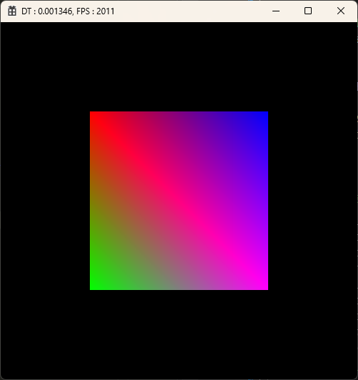
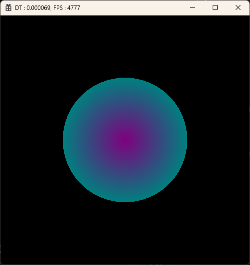
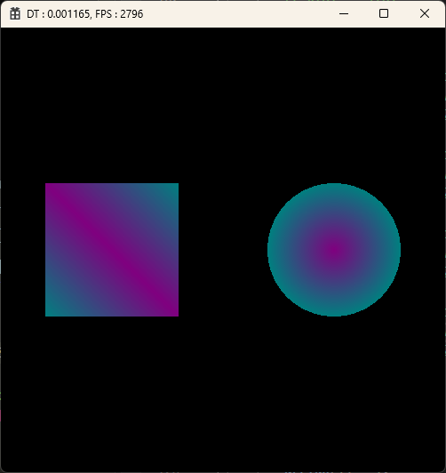

# project_DX2D_UnripeEngine
DirectX 2D Engine

**_24/01/09_** : 
&nbsp;&nbsp;- Unripe 엔진 초기화 
&nbsp;&nbsp;- type 재정의 (types.h) 
&nbsp;&nbsp;- Device, Context, SwapChain 분리 (CGraphics) 

**_24/01/10_** : 
&nbsp;&nbsp;- Time, Path, Key Manager 추가 
&nbsp;&nbsp;- SimpleMath 라이브러리 추가 

**_24/01/12_** : 
&nbsp;&nbsp;- PathMgr ) contentPath -> resourcePath, ShaderPath 변경 (Getter : GetResourcePath, GetShaderPath) 
&nbsp;&nbsp;- CEngine ) 사각형 출력 test 코드 추가 
&nbsp;&nbsp;&nbsp;&nbsp; 
&nbsp;&nbsp;- Debug 용 콘솔창 출력 코드 추가 
&nbsp;&nbsp;- Client) 메모리 누수 체크 코드 추가 
&nbsp;&nbsp;- CEngine) 상수버퍼 생성코드 추가 및 쉐이더 코드에 바인딩 
&nbsp;&nbsp;- 좌,우 방향키로 Rectangle 위치 조정 코드 추가 

**_24/01/13_** : 
&nbsp;&nbsp;- CEntity 클래스 추가 ← 모든 객체의 기본 ( member : id, name ) 
&nbsp;&nbsp;- CAsset 클래스 추가 ( ASSET_TYPE 열거형 추가 ) 
&nbsp;&nbsp;- CMesh 클래스 추가 ( VB, IB 생성 및 세팅, DrawIndexed() ) 
&nbsp;&nbsp;- CShader 클래스 추가 
&nbsp;&nbsp;- CGraphicShader 클래스 추가(VS, PS 생성 및 세팅) 
&nbsp;&nbsp;- Circle Mesh 출력코드 추가 
&nbsp;&nbsp;&nbsp;&nbsp; 
&nbsp;&nbsp;- CConstantBuffer 클래스 추가 (상수버퍼 생성,바인딩 기능 분리) 
&nbsp;&nbsp;- Client) 메모리 누수 발생 위치 체크 코드 추가 (new 재정의)

**_24/01/14_** : 
&nbsp;&nbsp;- CGameObject 클래스 추가 
&nbsp;&nbsp;- CComponent 클래스 추가 
&nbsp;&nbsp;- CTransform 클래스 추가 
&nbsp;&nbsp;- CRenderComponent 클래스 추가 
&nbsp;&nbsp;- CMeshRender 클래스 추가 
&nbsp;&nbsp;- CGraphics) 상수버퍼 멤버로 추가 
&nbsp;&nbsp;- std2d.fx) Scale 연산코드 추가 (VS_Std2D) 
&nbsp;&nbsp;- 객체 GameObjet화 하여 화면상에 여러개 출력 
&nbsp;&nbsp;&nbsp;&nbsp; 

**_24/01/15_** : 
&nbsp;&nbsp;- CScript 클래스 추가 (CGameObject 에 Script 관련 코드 추가) 
&nbsp;&nbsp;- CPlayerScript 클래스 추가 및 GameObject에 부착실습 
&nbsp;&nbsp;- CAssetMgr 클래스 생성 (Mesh, Shader 생성 담당) 

**_24/01/16_** : 
&nbsp;&nbsp;- CLevel, CLayer 클래스 추가 
&nbsp;&nbsp;- CLevelMgr 클래스 추가 
&nbsp;&nbsp;- 객체 생성 및 Init, Update, Render 과정을 CLevelMgr 에서 담당하도록 구조 변경 
&nbsp;&nbsp;- struct.h) 상수버퍼 대응 구조체 tTrasnform 멤버 수정 (float4->Matrix, World,View,Projection) 
&nbsp;&nbsp;- 변경된 상수버퍼 대응 구조체에 따라 쉐이더의 상수버퍼구조체 수정 
&nbsp;&nbsp;- std2d.fx) VS 연산수정 (World, View, Projection 행렬계산) 
&nbsp;&nbsp;- CPlayerScript) x,y,z 축 회전 구현 

**_24/01/17_** : 
&nbsp;&nbsp;- CEngine, CGraphics) 해상도(Resolution) 값 타입 float->Vec2 변경 
&nbsp;&nbsp;- CConstantBuffer) 상수버퍼 대응 구조체(tTransform) 객체 전역변수로 선언 (변수명 : g_tTransform) 
&nbsp;&nbsp;- CCamera 클래스 추가 (View, Porjection 변환 기능 추가중) 
&nbsp;&nbsp;- CCameraScript 클래스 추가 

**_24/01/18_** : 
&nbsp;&nbsp;- Camera) View변환 구현 (변환행렬 완성 : 카메라 이동변환, 회전변환 추가) 
&nbsp;&nbsp;- CameraScript) 카메라 위치이동 구현(W,A,S,D) 
&nbsp;&nbsp;- CKeyMgr) 마우스 드레그 관련 멤버, 함수 추가 (m_v2MouseDragDir, GetMouseDragDir()) 
&nbsp;&nbsp;- CameraScript) 카메라 회전이동 구현(마우스 드레그) 

**_24/01/19_** : 
&nbsp;&nbsp;- Camera) 카메라 투영(Projection)변환 적용 및 원근투영, 직교투영 구현 (투영방식 변환키 : P) 
&nbsp;&nbsp;- Clinet) 클라이언트 프로젝트 미리컴파일된 헤더 사용 설정 (pch_client) 
&nbsp;&nbsp;-  
&nbsp;&nbsp;-  

