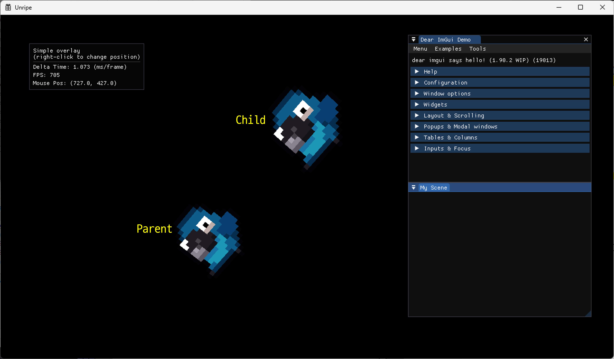

# project_DX2D_UnripeEngine
DirectX 2D Engine

**_24/01/09_** :<br>
&nbsp;&nbsp; - Unripe 엔진 초기화<br>
&nbsp;&nbsp; - type 재정의 (types.h)<br>
&nbsp;&nbsp; - Device, Context, SwapChain 분리 (CGraphics)<br>

**_24/01/10_** :<br>
&nbsp;&nbsp; - Time, Path, Key Manager 추가<br>
&nbsp;&nbsp; - SimpleMath 라이브러리 추가<br>

**_24/01/12_** :<br>
&nbsp;&nbsp; - PathMgr ) contentPath -> resourcePath, ShaderPath 변경 (Getter : GetResourcePath, GetShaderPath)<br>
&nbsp;&nbsp; - CEngine ) 사각형 출력 test 코드 추가<br>
&nbsp;&nbsp;&nbsp;&nbsp;<br>
&nbsp;&nbsp; - Debug 용 콘솔창 출력 코드 추가<br>
&nbsp;&nbsp; - Client) 메모리 누수 체크 코드 추가<br>
&nbsp;&nbsp; - CEngine) 상수버퍼 생성코드 추가 및 쉐이더 코드에 바인딩<br>
&nbsp;&nbsp; - 좌,우 방향키로 Rectangle 위치 조정 코드 추가<br>

**_24/01/13_** :<br>
&nbsp;&nbsp; - CEntity 클래스 추가 ← 모든 객체의 기본 ( member : id, name )<br>
&nbsp;&nbsp; - CAsset 클래스 추가 ( ASSET_TYPE 열거형 추가 )<br>
&nbsp;&nbsp; - CMesh 클래스 추가 ( VB, IB 생성 및 세팅, DrawIndexed() )<br>
&nbsp;&nbsp; - CShader 클래스 추가<br>
&nbsp;&nbsp; - CGraphicShader 클래스 추가(VS, PS 생성 및 세팅)<br>
&nbsp;&nbsp; - Circle Mesh 출력코드 추가<br>
&nbsp;&nbsp;&nbsp;&nbsp;<br>
&nbsp;&nbsp; - CConstantBuffer 클래스 추가 (상수버퍼 생성,바인딩 기능 분리)<br>
&nbsp;&nbsp; - Client) 메모리 누수 발생 위치 체크 코드 추가 (new 재정의)

**_24/01/14_** :<br>
&nbsp;&nbsp; - CGameObject 클래스 추가<br>
&nbsp;&nbsp; - CComponent 클래스 추가<br>
&nbsp;&nbsp; - CTransform 클래스 추가<br>
&nbsp;&nbsp; - CRenderComponent 클래스 추가<br>
&nbsp;&nbsp; - CMeshRender 클래스 추가<br>
&nbsp;&nbsp; - CGraphics) 상수버퍼 멤버로 추가<br>
&nbsp;&nbsp; - std2d.fx) Scale 연산코드 추가 (VS_Std2D)<br>
&nbsp;&nbsp; - 객체 GameObjet화 하여 화면상에 여러개 출력<br>
&nbsp;&nbsp;&nbsp;&nbsp;<br>

**_24/01/15_** :<br>
&nbsp;&nbsp; - CScript 클래스 추가 (CGameObject 에 Script 관련 코드 추가)<br>
&nbsp;&nbsp; - CPlayerScript 클래스 추가 및 GameObject에 부착실습<br>
&nbsp;&nbsp; - CAssetMgr 클래스 생성 (Mesh, Shader 생성 담당)<br>

**_24/01/16_** :<br>
&nbsp;&nbsp; - CLevel, CLayer 클래스 추가<br>
&nbsp;&nbsp; - CLevelMgr 클래스 추가<br>
&nbsp;&nbsp; - 객체 생성 및 Init, Update, Render 과정을 CLevelMgr 에서 담당하도록 구조 변경<br>
&nbsp;&nbsp; - struct.h) 상수버퍼 대응 구조체 tTrasnform 멤버 수정 (float4->Matrix, World,View,Projection)<br>
&nbsp;&nbsp; - 변경된 상수버퍼 대응 구조체에 따라 쉐이더의 상수버퍼구조체 수정<br>
&nbsp;&nbsp; - std2d.fx) VS 연산수정 (World, View, Projection 행렬계산)<br>
&nbsp;&nbsp; - CPlayerScript) x,y,z 축 회전 구현<br>

**_24/01/17_** :<br>
&nbsp;&nbsp; - CEngine, CGraphics) 해상도(Resolution) 값 타입 float->Vec2 변경<br>
&nbsp;&nbsp; - CConstantBuffer) 상수버퍼 대응 구조체(tTransform) 객체 전역변수로 선언 (변수명 : g_tTransform)<br>
&nbsp;&nbsp; - CCamera 클래스 추가 (View, Porjection 변환 기능 추가중)<br>
&nbsp;&nbsp; - CCameraScript 클래스 추가<br>

**_24/01/18_** :<br>
&nbsp;&nbsp; - Camera) View변환 구현 (변환행렬 완성 : 카메라 이동변환, 회전변환 추가)<br>
&nbsp;&nbsp; - CameraScript) 카메라 위치이동 구현(W,A,S,D)<br>
&nbsp;&nbsp; - CKeyMgr) 마우스 드레그 관련 멤버, 함수 추가 (m_v2MouseDragDir, GetMouseDragDir())<br>
&nbsp;&nbsp; - CameraScript) 카메라 회전이동 구현(마우스 드레그)<br>

**_24/01/19_** :<br>
&nbsp;&nbsp; - Camera) 카메라 투영(Projection)변환 적용 및 원근투영, 직교투영 구현 (투영방식 변환키 : P)<br>
&nbsp;&nbsp; - Clinet) 클라이언트 프로젝트 미리컴파일된 헤더 사용 설정 (pch_client)<br>
&nbsp;&nbsp; - CameraScript) 마우스 휠 조작을 통한 Zoom In/Zoom Out 조작기능 추가<br>
&nbsp;&nbsp; - Graphics) RasterizerState/DepthStencilState/BlendState 추가 <br>
&nbsp;&nbsp; - GraphicShader) Mesh/Shader 생성 함수 분리 및 Shader 생성시 RS/DS/BS 적용<br>
&nbsp;&nbsp; - CAssetMgr) Shader 생성시 RS/DS/BS 값 설정 <br>
&nbsp;&nbsp;&nbsp;&nbsp;<br>

**_24/01/22_** :<br>
&nbsp;&nbsp; - DirectXTex 라이브러리 추가<br>
&nbsp;&nbsp; - Dear ImGui 추가<br>
&nbsp;&nbsp;&nbsp;&nbsp;<br>
&nbsp;&nbsp; - CImGuiMgr 클래스 추가<br>
&nbsp;&nbsp; - CImGuiMgr) Simple Overlay 창 추가 (DeltaTime, FPS, MousePos)<br>
&nbsp;&nbsp; - CTexture 클래스 추가<br>
&nbsp;&nbsp; - CAssetMgr) Texture Load 함수 구현 (LoadTexture())<br>
&nbsp;&nbsp; - CLevelMgr) Texture 출력 간단구현<br>
&nbsp;&nbsp;&nbsp;&nbsp;<br>

**_24/01/23_** :<br>
&nbsp;&nbsp; - CGraphics) SamplerState 추가(type : ANISOTROPIC, POINT)<br>
&nbsp;&nbsp;&nbsp;&nbsp;<br>
&nbsp;&nbsp; - CGameObject) 부모/자식 계층 관계 설계<br>
&nbsp;&nbsp; - CTransform) World/Local 좌표 설계<br>
&nbsp;&nbsp;&nbsp;&nbsp;<br>
&nbsp;&nbsp; - **"계층구조"** 추가에 따른 Level,Layer 설계 및 객체 추가함수 수정<br>
<!-- ```
[보완 내용]

- enum) LAYER_TYPE 열거형 클래스 추가 (Layer 구분)
- CLevelMgr) GetCurrentLevel() 함수 추가 -> 현재 렌더링중인 Level의 주소값 반환
- CLevel) GetLayer() 함수 추가 -> 특정 Layer의 주소값 반환
- CLevel) AddObject() 함수 보완 -> 인자로 넣어주는 레이어 구분값을 int형에서 열거형 클래스로 변경
- CLayer) CLayer 객체 생성시 생성자에 반드시 Layer 타입을 넣도록 수정
- CLayer) Layer 객체 등록함수 수정 및 보완

``` -->

**_24/01/24_** :<br>
<!-- ```
[ GameObject 렌더링 과정 ] 
  ================================================
    Begin() -> Tick() -> FinalTick() -> Render()
  ================================================
- FinalTick() 과정에서 해당 객체가 소속된 Layer의 Object 관리 멤버(m_vecObj)에 삽입된다.
- Layer의 Render() 과정을통해 해당 Layer에 소속된 객체들의 Render()가 호출된다.
- 자식 객체의 경우 부모객체에 의해서 Begin()/Tick()/FinalTick()가 호출되며, 부모객체와 마찬가지로 Layer에 의해 Render()가 호출된다.

``` -->
&nbsp;&nbsp; - CTaskMgr 클래스 추가 (Tick() 함수 구현중)<br>
&nbsp;&nbsp; - func.cpp) GamePlayStatic::SpawnGameObject() 구현 (CLevel::AddObject() 함수 대체)<br>
&nbsp;&nbsp; - 계층 구조에 따른 렌더링 과정 전체적으로 수정 및 보완 <br>
<!-- ```
[ 보완내용 ]

- CGameObject) 렌더링을 위해 FinalTick() 과정에서 해당 객체를 소속된 Layer의 m_vecObject에 삽입 해주는 코드 추가
- CLevel) Clear() 함수 추가 -> 이전 프레임에서 Render를 위해 Layer의 m_vecObject에 추가된 GameObject 객체들 clear
- CLevel) AddObject() 함수 보완 -> 프래그(bool) 값을 넣어줌으로써 인자로 들어온 객체가 Layer에 추가될 때, 자식 객체도 함께 해당 레이어에 소속될지에 대한 설정을 할 수 있다. (기본값 = false)

``` -->
&nbsp;&nbsp; - GarbageCollector 클래스 추가<br>

**_24/01/25_** :<br>
&nbsp;&nbsp; - CGarbageCollector 클래스 추가<br>
&nbsp;&nbsp; - CTaskMgr) GameObject 객체 제거 구현 (TASK_TYPE::SUB_OBJECT)<br>
&nbsp;&nbsp; - CMaterial 클래스 추가<br>
<!-- ```
[관련 작업]

- CGraphics) CreateConstBuffer() 에서 Material용 상수버퍼 추가생성 (CB_TYPE::MATERIAL_CONST)
- CConstantBufer) 상수버퍼 생성자 수정 -> 생성시 해당하는 상수버퍼 타입(CB_TYPE)을 인자로 넣어줘야함 
- CConstantBufer) UpdateData() 함수에 데이터를 넘겨줄 레지스터의 번호를 인자로 넘겨주지 않아도 됨
- CAssetMgr) CMaterial 객체 생성 및 AssetMgr의 m_mapAsset에 저장
- CRenderComponent, CMeshRender) Shader->Material로 대체됨에 따라 기존의 Shader 관련 객체와 함수를 Material 에 맞게 수정
- CLevelMgr) 임시 Player 객체에 Shader 대신 Material 추가, Material 전용 상수버퍼에 값 추가

``` -->
&nbsp;&nbsp; - test) 재질 전용 상수버퍼에 1의 값이 들어가있으면 Pixel Shader에서 이미지에 흰색칠하기<br>
&nbsp;&nbsp;&nbsp;&nbsp;<br>

**_24/01/26_** :<br>
&nbsp;&nbsp; - Asset 전용 스마트 포인터 클래스(Ptr) 추가 <br>

**_24/01/29_** :<br>
&nbsp;&nbsp; - 스마트 포인터 Asset 관련 클래스에 적용<br>
&nbsp;&nbsp; - enum) SCALAR_PARAM 열거형 클래스 추가<br>
&nbsp;&nbsp; - CMaterial) SetScalarParam(), SetTexParam() 함수로 스칼라 값과 이미지 정보 세팅 후 UpdateData() 과정을 통해 GPU로 넘겨줌<br>

**_24/01/31_** :<br>
&nbsp;&nbsp; - CRenderMgr 클래스 추가 (Camera 기반 Render 구조로 변경)<br>
&nbsp;&nbsp; - CRenderMgr) Debug용 Rect 임시 구현 (추가 구현 예정)<br>
&nbsp;&nbsp;&nbsp;&nbsp;<br>
&nbsp;&nbsp; - CCollider2D 클래스 추가 (적용시키는 코드 추가 구현 예정)<br>

**_24/02/01_** :<br>
&nbsp;&nbsp; - CAssetMgr) Debug 전용 Mesh(RectMesh_Debug, CircleMesh_Debug) 생성 <br>
&nbsp;&nbsp; - CAssetMgr) Debug Shader 설정 수정(Topology, DepthStencilState)<br>
&nbsp;&nbsp; - 확대정도에 따라 DebugMesh의 굵기가 달라지던 문제 해결<br>
&nbsp;&nbsp;&nbsp;&nbsp;<br>
&nbsp;&nbsp; - CCollisionMgr 클래스 추가 (기능 : 충돌체 충돌 관리)<br>
&nbsp;&nbsp; - CCollisionMgr) RECT-RECT, RECT-CIRCLE, CIRCLE-CIRCLE 충돌 구현(RECT-CIRCLE 충돌 보완필요)<br>
&nbsp;&nbsp;&nbsp;&nbsp;<br>

**_24/02/02_** :<br>
&nbsp;&nbsp; - CCollisionMgr) OBB 충돌연산 코드 모듈화(ObbRectRect, ObbCircleRect, ObbCircleCircle)<br>
&nbsp;&nbsp; - CCollisionMgr) RECT-CIRCLE 충돌 문제 해결<br>
&nbsp;&nbsp; - CAnimator2D 클래스 추가<br>
&nbsp;&nbsp; - CAnimation 클래스 추가<br>
&nbsp;&nbsp; - CGameObject) Destroy 함수 추가<br>
&nbsp;&nbsp; - CAnimation,CAnimator2D) Animation 기능 구현 및 Player,Monster 객체에 적용<br>
&nbsp;&nbsp;&nbsp;&nbsp;<br>
&nbsp;&nbsp; - CLevelMgr) UICam객체 생성 -> MainCam이 움직여도 UICam에 의해 Render 되는 객체들은 화면상 고정됨<br>
&nbsp;&nbsp; - Cross_Debug Mesh 추가 및 GamePlayStatic::DrawDebugCross() 구현으로 중심점위치 CrossMesh로 표시<br>
&nbsp;&nbsp;&nbsp;&nbsp;<br>

**_24/02/03_** :<br>
&nbsp;&nbsp; - Animation에 Background 개념 추가 (O key : DebugObj Render On/Off)<br>
&nbsp;&nbsp;&nbsp;&nbsp;<br>
&nbsp;&nbsp; - 구조화버퍼(CStructuredBuffer) 클래스 추가 및 테스트<br>

**_24/02/04_** :<br>
&nbsp;&nbsp; - CStructuredBuffer) 읽기/쓰기용 버퍼 추가(m_SB_Read, m_SB_Write)<br>
&nbsp;&nbsp; - CStructuredBuffer) 구조화 버퍼 데이터 Read/Write 기능 구현 (GPU로부터 데이터 읽어오는 기능 구현)<br>

**_24/02/05_** :<br>
&nbsp;&nbsp; - CLight2D 클래스 추가, <br>
&nbsp;&nbsp; - CRenderMgr) Light2D 객체 추가 함수 추가 (RegisterLight2D())<br>
&nbsp;&nbsp; - Background 객체 추가<br>
&nbsp;&nbsp; - Point, Directional 광원 생성 및 등록<br>
&nbsp;&nbsp;&nbsp;&nbsp; ▽ Directional Light<br>
&nbsp;&nbsp;&nbsp;&nbsp;<br>
&nbsp;&nbsp;&nbsp;&nbsp; ▽ Point Light<br>
&nbsp;&nbsp;&nbsp;&nbsp;<br>
&nbsp;&nbsp;&nbsp;&nbsp; ▽ Directional + Point Light<br>
&nbsp;&nbsp;&nbsp;&nbsp;<br>
&nbsp;&nbsp; - CAnimator2D, CAnimation) 애니메이션 반복재생 여부 설정가능하도록 수정<br>
&nbsp;&nbsp; - CCollider2D, CScript) Script에서 충돌처리 가능하도록 코드 추가<br>

**_24/02/06_** :<br>
&nbsp;&nbsp; - CScript) 스크립트에서 사용할 Texture 로드, Animation 생성가능<br>
&nbsp;&nbsp; - CShader) 도메인 개념 추가하여 이를 기준으로 쉐이더 구분 (OPAQUE, MASK, TRANSPARENT, POSTPROCESS, DEBUG)<br>
&nbsp;&nbsp; - CCamera) 도메인을 기준으로 객체를 분류한 후, 관련 도메인들끼리 따로 Render 과정을 거침<br>
<!-- &nbsp;&nbsp; - <br> -->


<!-- &nbsp;&nbsp;- <br> -->